# Angry-Owl
ECE4180 Fall 2019 Final Project, Georgia Institute of Technology\
Project Members: Jamie Lee, Jingyi Yu

## Summary
A motion-detecting owl scarecrow controlled by a Raspberry Pi 3 Model B. Can move forwards and backwards, rotate, make scary sounds, flap wings, and shine bright lights in the presence of live garden pests such as rodents and deer. The purpose is to scare away these pests which eat the leaves, fruits and vegetables of garden crops.

## Background Information
My dad maintains a large garden, but pests like raccoons and deer will often eat the fruits of his labor. He has tried store-bought deer repellent, but it did not work. It would be useful for gardeners if there was an infrared-detecting scarecrow that can move when it detects a sudden change in infrared radiation levels (i.e. an animal coming into view). Additionally, the scarecrow can make customizable sounds that can [scare the animals away](https://www.thestar.com/news/insight/2016/03/07/the-sound-that-strikes-fear-into-a-raccoons-heart.html). We decided to build our scarecrow in the form of an angry owl. The owl is a common predator among smaller pests, so the form of its silhouette alone can intimidate them. The loud sounds and commotion that the angry owl generates serves to scare off larger pests, such as deer and foxes.

## Electronics Parts List:
- 1x [Raspberry Pi 3 Model B](https://www.raspberrypi.org/products/raspberry-pi-3-model-b/)
- 1x mbed
- 1x Bare-Minimum RedBot Robot Kit
  - *The Bare-Minimum RedBot Robot Kit Contains:*
    - 1x [6" 3-Wire Cable](https://www.sparkfun.com/products/13164)
    - 1x [Pair of Wheels](https://www.sparkfun.com/products/13259)
    - 1x [Pair of 140-RPM Hobby Gearmotors](https://www.sparkfun.com/products/13302)
    - 1x [Shadow Chassis](https://www.sparkfun.com/products/13301)
    - 1x 4 AA Battery Pack and 5v barrel jack breadboard plug
- 1x [PCB Mount Speaker](https://www.sparkfun.com/products/11089)
- 1x [Class-D Amplifier](https://os.mbed.com/components/TPA2005D1-Class-D-Audio-Amp/)
- 1x [SparkFun microSD Transflash Breakout](https://www.sparkfun.com/products/544)
- 1x [microSD Card - 16GB (Class 10)](https://www.sparkfun.com/products/15051)
- 2x [Super Bright White 5mm LED for eyes](https://www.adafruit.com/product/754)
- 3x [PIR Motion Sensors](https://www.adafruit.com/product/189)
- 1x [Raspberry Pi Camera Module V2](https://www.raspberrypi.org/products/camera-module-v2/)
- 1x [HS-422 Servo (Clockwise, Stock Rotation)](https://www.servocity.com/hs-422-servo#258=24&259=25)
- 1x [Pair of 140-RPM Hobby Gearmotors (for wing movement)](https://www.sparkfun.com/products/13302)
- 2x Dual-H Bridge Module
- 4x mini breadboards

## Structural Parts List
- An empty coffee can for the owl's body
- Cardboard for owl wings and face
- Access to drilling equipment

## Part 1 Instructions (Structural Set-up)
1. Assemble the bare-minimum RedBot Robot Kit by following [Step 2 (Motors and Wheels)](https://learn.sparkfun.com/tutorials/assembly-guide-for-redbot-with-shadow-chassis/2-motors-and-wheels) and [Step 5 (Chassis)](https://learn.sparkfun.com/tutorials/assembly-guide-for-redbot-with-shadow-chassis/5-chassis) in the [Assembly Guide for RedBot with Shadow Chassis](https://learn.sparkfun.com/tutorials/assembly-guide-for-redbot-with-shadow-chassis).
2. Measure the diameter of the rotational connector on the bottom side of the servo face plate. Drill a hole the size of the 
servo's face place connector into the bottom of the coffee can. Superglue the servo face plate to the bottom of the 
inside of the coffee can, with the flat side facing up and the nub fitting securely into the hole of the coffee can. 
The servo will be attached outside of the bottom of the coffee can later.
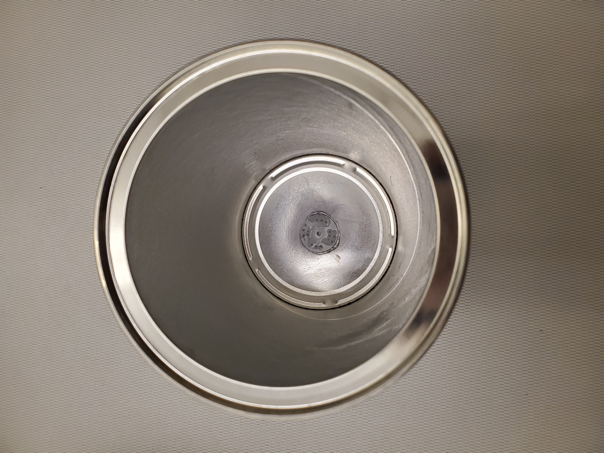

3. Drill three holes evenly spaced apart around the girth of the coffee can for the PIR Sensors.
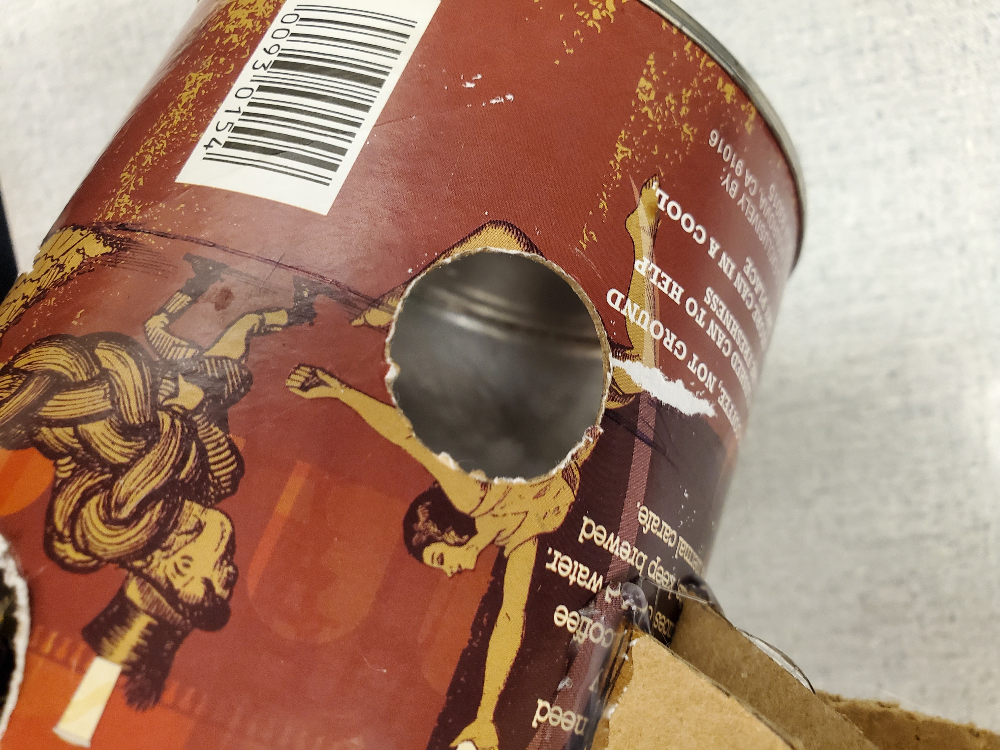
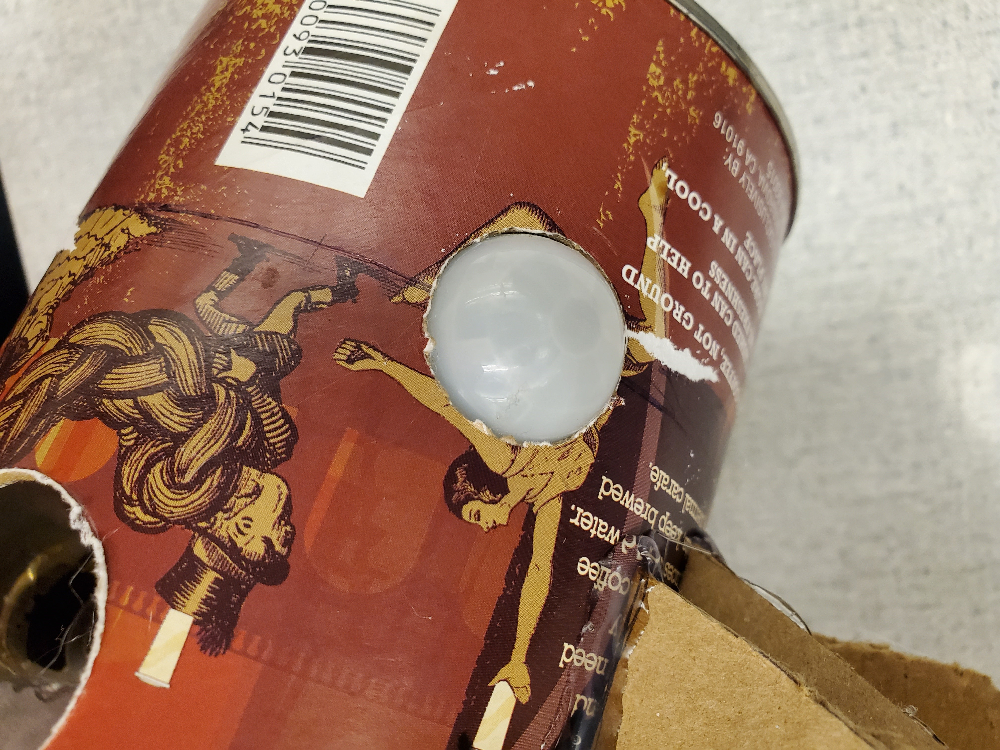
4. Drill a hole in the front and back to fit the speakers and two holes in the sides to fit the hobby gearmotors.
5. Add additional holes in the bottom of the can to accommodate the wires that will come from the RedBot's wheel motors.
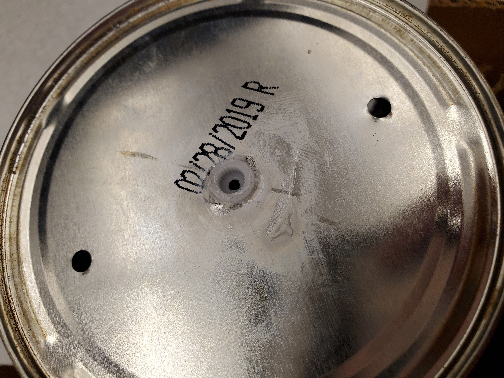
6. Sketch and cut out 4 identical cardboard wings.
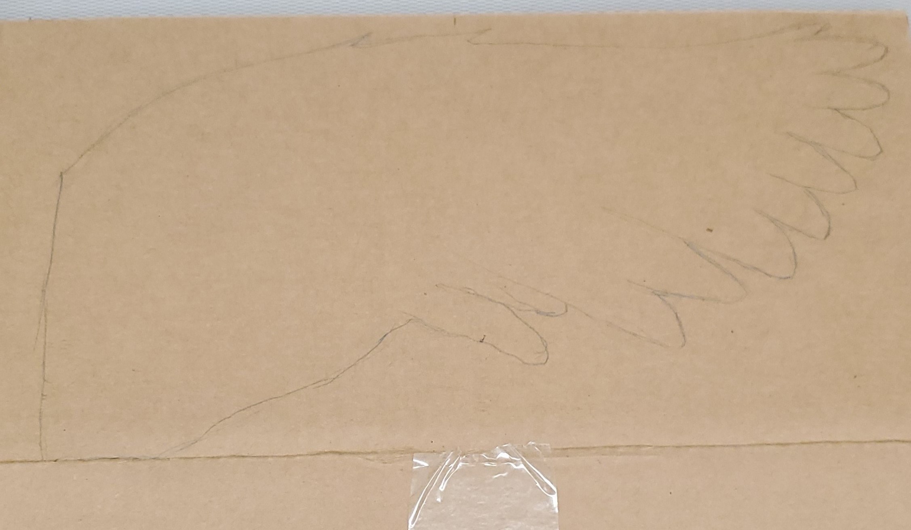
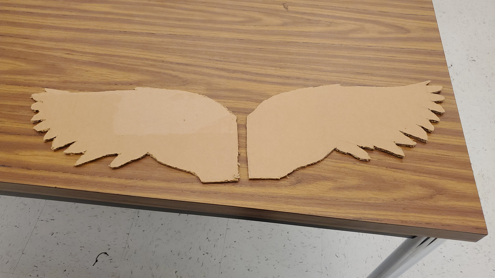
7. Connect one pair of wheels to their motors and hot glue two wing cutouts to the wheels like in the images below. The 
end of the wing tips should be glued together at the opposite end of the wheel.
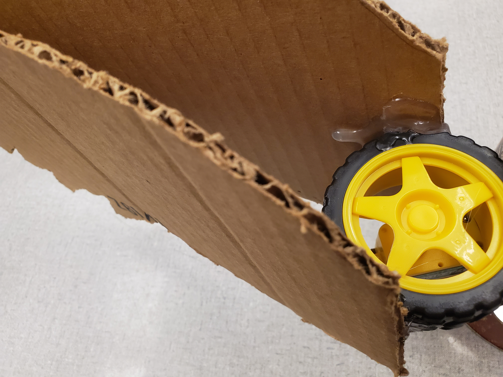
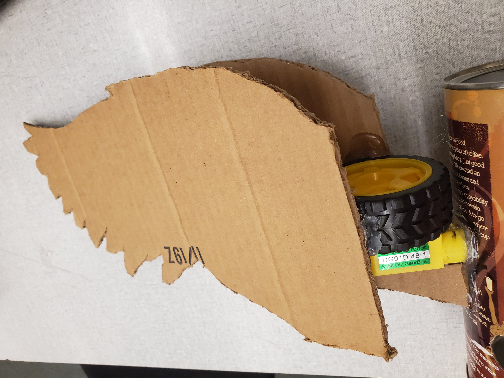
8. Hot glue the motors into place of their designated holes in the coffee can. Hot gluing the motors from the inside can
help with stability. Hot glue triangle-shaped cardboard support structures underneath each wing motor.
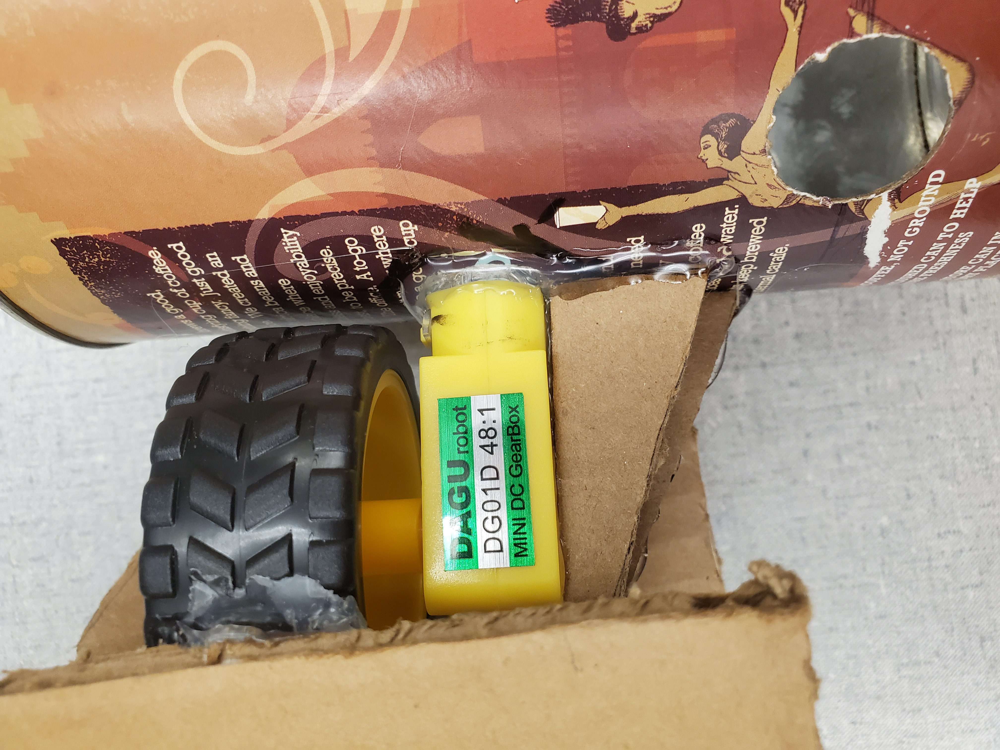
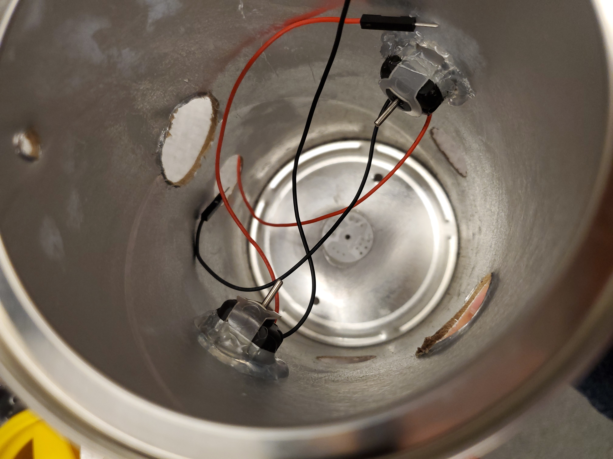


## Part 2 Instructions: Hardware Overview
1. Wire the motors
2. [Wire up the speakers and Class-D amplifier.](speaker-setup.md)
3. Follow the schematic below for guidance on wiring the other parts:
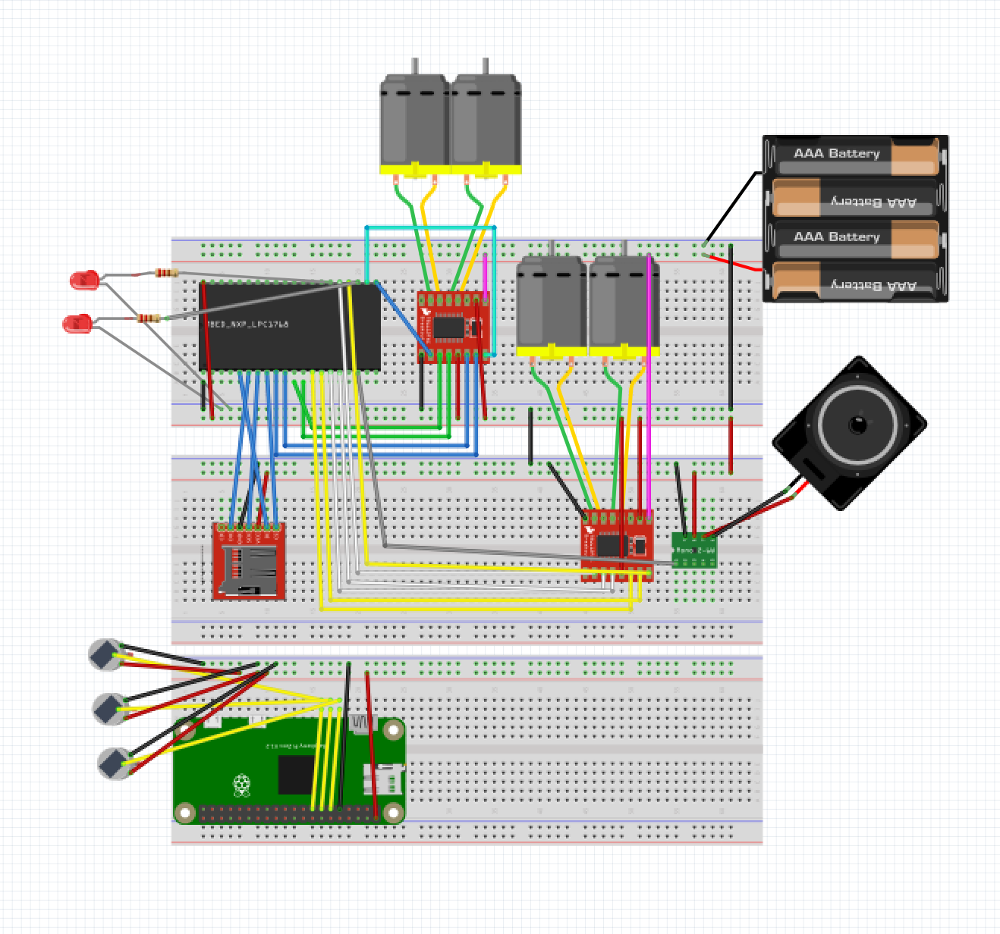

Once the parts are wired, write the software (see Software Overview section) and load the code onto the mbed and pi. Once 
the hardware and software components are completed, place the mini-breadboards 
into the coffee can.


## Part 3 Instructions: Software Overview
### mbed code
```c++
#include "Servo.h"
#include "mbed.h"
#include "motordriver.h"
#include "rtos.h"
#include "stdio.h"
#include "SDFileSystem.h"
#include "wave_player.h"

volatile bool alarm  = false;

DigitalOut led1(LED1);
DigitalOut led2(LED2);
DigitalOut led3(LED3);
DigitalOut led4(LED4);

Ticker wing;
Ticker bark;

RawSerial pi(USBTX, USBRX);
Servo myservo(p23);      
Motor wingL(p22, p9, p10, 1); // pwm, fwd, rev
Motor wingR(p21, p12, p11, 1);//wings move in opposite directions
//reverse one motor's leads when wiring
Motor wheelL(p24, p14, p13, 1);
Motor wheelR(p25, p16, p15, 1);//wheels move in the same direction
PwmOut led1(p23);
PwmOut led2(p26);
AnalogIn flag(p20);

SDFileSystem sd(p5, p6, p7, p8, "sd");
AnalogOut DACout(p18);
wave_player waver(&DACout);
Mutex spk_mutex;
Mutex servo_mutex;
Mutex wing_mutex;
Mutex alrm_mutex;
char temp;

void startMotors() {
    for (float s= -1.0; s < 1.0 ; s += 0.002) 
        {
            wingL.speed(s);
            wingR.speed(s);
            wait(0.0005);
        }

    for (float x = -1.0; x< 1.0; x += 0.1)
        {
            wheelL.speed(x);
            wheelR.speed(x);
            wait(0.2);
        }
}

void stopMotors() {
    wingL.speed(0);
    wingL.speed(0);
    
    wheelL.speed(0);
    wheelR.speed(0);
}

void startSound() {
    FILE *wave_file;
    wave_file=fopen("/sd/sound00.wav","r");
    waver.play(wave_file);
    fclose(wave_file);
}

void piDetectInvader()
{
    while(true)
    {
        while(pi.readable())
        {
            temp = pi.getc();
            pi.putc(temp);
            
            if(temp == '1') { 
                alarm = true;
                led1=1;
                led2=0;
                startMotors();
                startSound();

            }
            if(temp == '0') {
                alarm = false;
                led1=0;
                led2=1;
                stopMotors();
            }
        }
    }
}

int main() 
{   
    pi.baud(9600);
    pi.attach(&piDetectInvader, Serial::RxIrq);

    while(true) { } 
}
```

PiZero code:
```c

```

Suggested wav file sound clips:
- Dog bark (works best for raccoons)
- Gun Shot
- Hawk screech
- Fireworks

## Video Demo